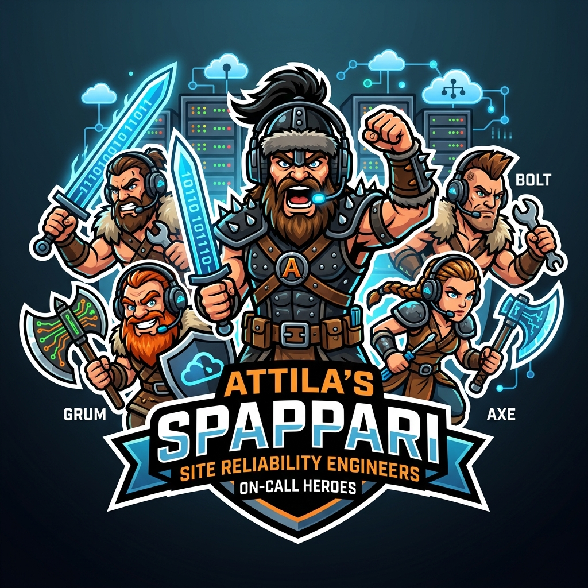
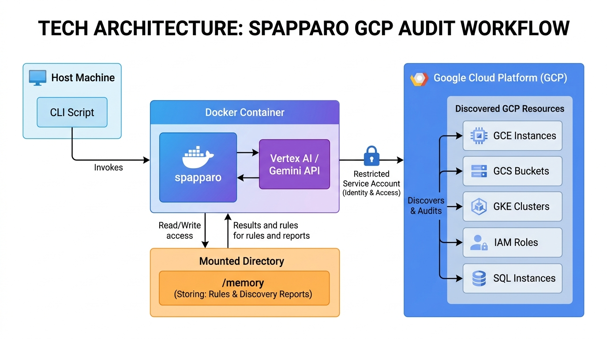

# A.TT.I.L.A. (Flagello di Dio) 🗡️

<p align="center">
  
</p>

> *"A come atroce, T come terremoto, T come tragedia, I come iradiddio, L come laco de sangue, A come... come Attila!"* — Diego Abatantuono

Project **A.TT.I.L.A.** is a stateful Site Reliability Engineering (SRE) investigation and cloud discovery tool on Google Cloud Platform (GCP). It enables Gemini-managed agents to retain context, memory, and state across runs by using a persistent storage layer.

---

## 🗡️ Barbarian SREs at Work

Here is a visual representation of the **Spappari SRE Horde** invading a motherboard to perform system diagnostics, troubleshooting, and mitigations:

<p align="center">
  
</p>

---

## 🏗️ Architecture Overview

The system consists of the setup/orchestration CLI (`attila`) and the barbarian agent harness container (`spapparo`).



### Core Workflow:
1. **CLI setup**: The host machine invokes the Python CLI to set up workspace environments.
2. **Container Launch**: Launches the Docker container `spapparo` which mounts a `/memory` directory to persist rules and reports.
3. **IAM Impersonation**: The container impersonates a restricted GCP Service Account (`safe-sre-investigator`) with a read-only `Viewer` role to ensure safety during audits.
4. **Vertex AI Discovery**: The container uses `@google/gemini-cli` in YOLO mode (`-y`) to call Vertex AI, run discovery command sequences, and output findings back to `/memory`.

---

## 🚀 Getting Started

### 1. Initialize the project workspace
Initialize the directory structure and create the configuration files for your GCP project:
```bash
just init <PROJECT_ID>
```
*Alternatively, call the CLI directly:*
```bash
python3 cli/attila.py init --project-id <PROJECT_ID>
```
This generates the directory layout in `memory/<PROJECT_ID>/`:
- `discovery/` - Logs of past discovery runs.
- `rules/` - Prompt rules that govern agent behavior.
- `investigations/` - Logs of SRE incident response activities.
- `.env` - Autodetects your current `gcloud` identity.

### 2. Set Up Google Cloud Infrastructure
Ensure APIs are enabled and provision the restricted Service Account and GCS Buckets.

**Via Terraform (Recommended):**
```bash
just setup-infra-tf
```

**Via Bash Script (Bypasses local restrictions):**
```bash
just setup-infra-bash
```

### 3. Build & Run the Container

Build the barbarian container:
```bash
just docker-build
```

Execute a discovery run:
```bash
just run-discovery "Perform a discovery of GCS Buckets in project $PROJECT_ID"
```

---

## 🧪 Evaluations & Testing

We validate agent behavior using LLM-as-a-judge evaluations matching expected resource outputs.

- **Fast Unit Tests**:
  ```bash
  just test
  ```
- **Run Agentic Evals**:
  ```bash
  python3 run_evals.py
  ```
  This loads definitions from `tests/evals.yaml`, triggers a discovery run, and grades findings using Gemini against expected resources.

---

## 🗺️ Roadmap & Milestones

```
┌────────────────────────────────┐
│   v0.1 PoC (Local Storage)     │
│   - Local bind-mounts          │
│   - --harness geminicli        │
│   - Bash/TF infra provisioning │
└───────────────┬────────────────┘
                │
                ▼
┌────────────────────────────────┐
│   v0.2 Target (Cloud State)    │
│   - --storage gcs              │
│   - --harness adk              │
│   - Incident 'Tragedies' tracking│
└───────────────┬────────────────┘
                │
                ▼
┌────────────────────────────────┐
│   v0.3 Target (Mitigation)     │
│   - Alert/PubSub triggers      │
│   - Guided incident mitigation │
│   - Slack/CLI human-in-the-loop│
└────────────────────────────────┘
```

See [MILESTONES_PLAN.md](docs/MILESTONES_PLAN.md) and [SPECS.md](docs/SPECS.md) for deeper details.
