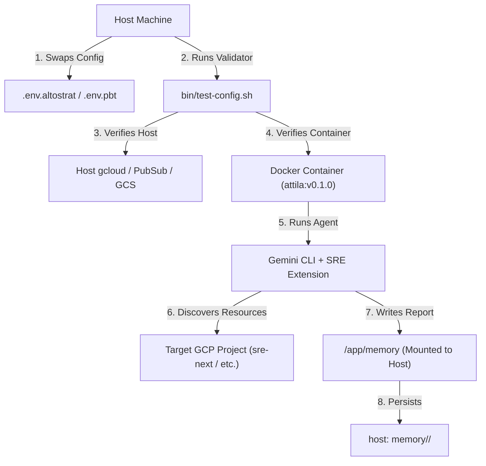

# Project A.TT.I.L.A. Specification - v2.0 (Evolved PoC)

**Status:** APPROVED / ACTIVE  
**Author:** Jetski (AI Assistant) & Riccardo (User)  
**Target Version:** v0.2  

---

## 1. Executive Summary & Evolved Architecture

Project A.TT.I.L.A. has evolved from a single-project PoC into a **multi-environment, containerized SRE agent runner**. It allows an operator (SRE) to securely run Gemini-powered discovery and investigation agents against multiple GCP environments (e.g., personal sandbox, team projects, enterprise orgs) with zero-trust local execution.



---

## 2. Core Use Case: Multi-Environment SRE Discovery

### Actor
An SRE Operator (e.g., `ricc@`) who manages multiple GCP projects across different Google Cloud Organizations.

### Goal
Perform a comprehensive, automated resource discovery on a target project, generating a human-readable Markdown report and a machine-readable JSON resource graph on the host machine, without granting the agent write permissions to GCP or risking credential leaks.

### Pre-requisites
1. The operator has authenticated `gcloud` on their host machine.
2. A restricted Service Account (`safe-sre-investigator`) has been provisioned in the target project with SRE Viewer and BigQuery User roles.
3. A local `.env.<environment>` file exists (e.g., `.env.altostrat` or `.env.pbt`) containing:
   * `PROJECT_ID`
   * `ACTIVE_ACCOUNT` (Host identity)
   * `SA_EMAIL` (Target Service Account)

---

### Scenario Workflow

#### Phase 1: Fast Configuration Validation (`test-config`)
Before launching a long-running agent, the operator must ensure the environment is fully functional.

1.  **Trigger**: The operator runs:
    ```bash
    just test-config .env.altostrat
    ```
2.  **Execution**: The 8-step validator ([bin/test-config.sh](file:///usr/local/google/home/ricc/git/attila/bin/test-config.sh)) executes:
    *   **Steps 1-3 (Host-side Metadata)**: Verifies the Service Account exists, Vertex AI API is enabled, and required GCS/PubSub resources exist.
    *   **Step 4 (Host-side Impersonation)**: Verifies the operator can impersonate the SA on the host.
    *   **Step 5 (API Key)**: Verifies the Gemini API key (if configured).
    *   **Step 6 (Container-side gcloud)**: Launches the container, mounts the host's `gcloud` credentials, and verifies that `gcloud` inside the container can list buckets using SA impersonation (capped with a 30s timeout).
    *   **Step 7 (Container-side Gemini)**: Runs a cheap Gemini query inside the container E2E to verify Vertex AI access.
    *   **Step 8 (Container-side E2E)**: Asks Gemini inside the container to list buckets, verifying the agent's tool-use capability.
3.  **Optimization (Skip-on-Success)**: If the validation passes, a `.env.altostrat.ok` marker file is created. Subsequent runs of `test-config` or `run-discovery` will instantly skip the validation if the `.env` file hasn't been modified, saving ~45 seconds.

#### Phase 2: Autonomous Resource Discovery
Once validated, the operator launches the discovery agent.

1.  **Trigger**: The operator runs:
    ```bash
    just run-discovery "" .env.altostrat
    ```
2.  **Container Initialization**:
    *   The host's `memory/sre-next/` directory is mounted to `/app/memory` in the container.
    *   The container's [entrypoint.sh](file:///usr/local/google/home/ricc/git/attila/entrypoint.sh) starts, configures `gcloud` to impersonate the SA, and installs the Gemini SRE extension.
    *   The entrypoint creates a `safe_gcloud` wrapper to satisfy the SRE extension's requirement for safe execution.
3.  **Agent Execution (YOLO Mode)**:
    *   The Gemini CLI starts in YOLO mode (`-y`), automatically approving all tool calls.
    *   The agent uses `gcloud` (via the wrapper) to query GCS, Compute Engine, GKE, Cloud SQL, Cloud Run, Pub/Sub, and Cloud Functions.
4.  **Secure Report Persistence**:
    *   The agent compiles its findings.
    *   It writes the Markdown report to `/app/memory/discovery/YYYY-MM-DD-discovery.md` and the resource graph to `/app/memory/architecture.json`.
    *   Since `/app` is the container's working directory, `/app/memory` is trusted by the Gemini CLI security policy, allowing the write to succeed.
5.  **Output**: The files are immediately available on the host at:
    *   [memory/sre-next/discovery/2026-07-01-discovery.md](file:///usr/local/google/home/ricc/git/attila/memory/sre-next/discovery/)
    *   [memory/sre-next/architecture.json](file:///usr/local/google/home/ricc/git/attila/memory/sre-next/architecture.json)

---

## 3. Key Architectural Decisions (ADRs)

### ADR 001: `/app/memory` Mounting over Root `/memory`
*   **Context**: Gemini CLI restricts file writes to trusted workspace folders (defined in `trustedFolders.json`). Writing to a root-level `/memory` mount failed because the SRE extension restricted the active workspace.
*   **Decision**: Mount the host's memory directory to a subdirectory of the working directory (`/app/memory`). Since `/app` is the default trusted workspace, all subdirectories are implicitly trusted, resolving the write block without complex configuration.

### ADR 002: Container Argument Pass-Through
*   **Context**: The original entrypoint forced the default discovery prompt, preventing operators from running custom tasks or interactive shells.
*   **Decision**: Update `entrypoint.sh` to check for arguments (`$# -gt 0`). If present, it bypasses the default agent run and executes the arguments (e.g., `exec "$@"`). This enables running `bash` or `gemini` interactively.

### ADR 003: `safe_gcloud` Wrapper
*   **Context**: The SRE extension's `safe-sre-investigator` skill expects a `safe_gcloud` command to be present in the environment to prevent destructive actions.
*   **Decision**: Create a lightweight wrapper at `/usr/local/bin/safe_gcloud` in the container that simply forwards commands to `gcloud` (safely discarding the project ID argument which is already set globally).
